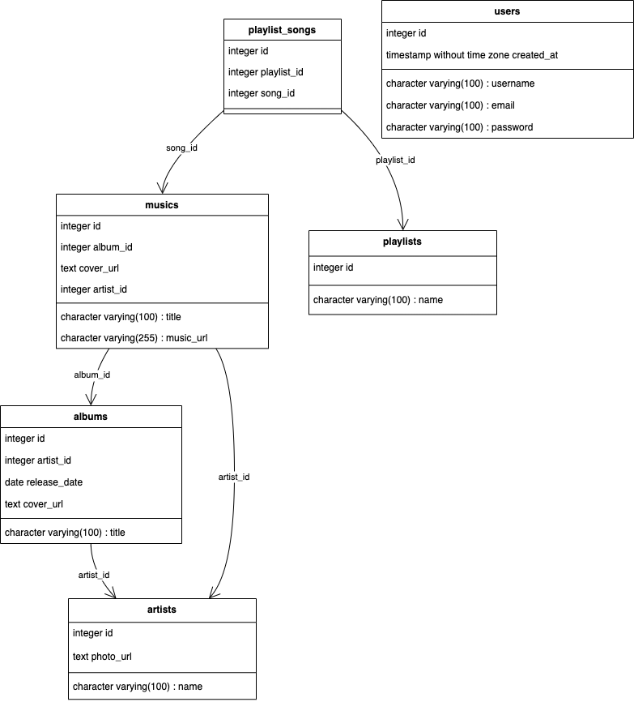
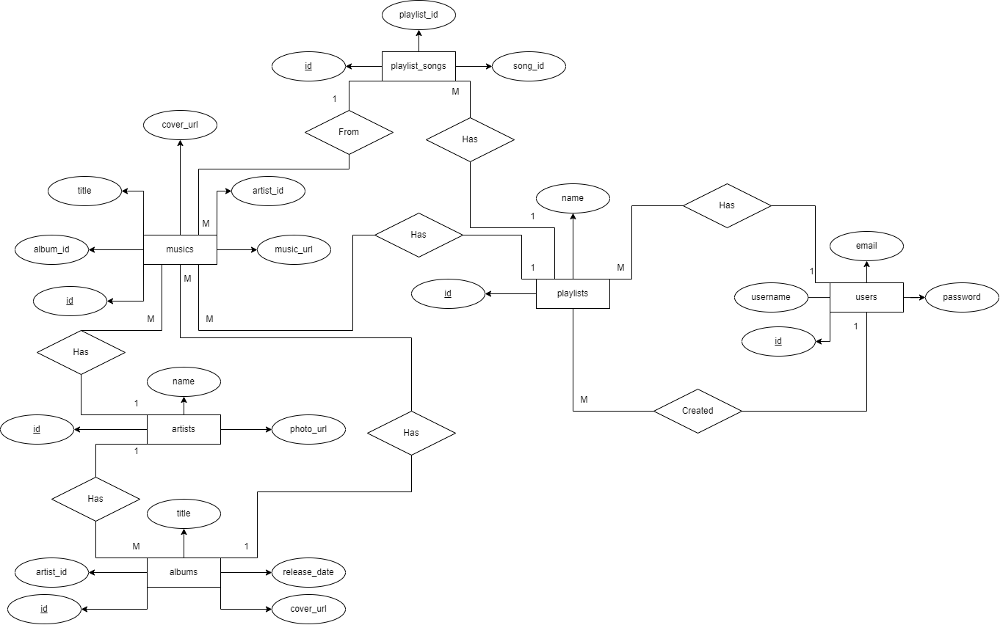
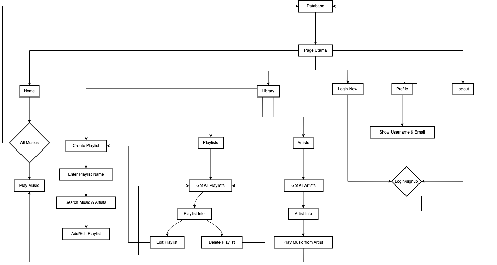

# SpotLITE
Proyek ini merupakan pengembangan sebuah aplikasi web streaming musik yang dirancang untuk memberikan pengalaman mendengarkan musik yang intuitif dan menyenangkan. Aplikasi ini memungkinkan pengguna untuk menjelajahi berbagai lagu, mengelola playlist pribadi, dan mengakses informasi artis dengan mudah.

## Tech Stack
PostgreSQL | JavaScript | HTML | Express.js | NPM | NodeJS | React | TailwindCSS 

## Diagram 
> Unified Modeling Language (UML)

> Entity Relationship Diagram (ERD)

> Flowchart


## Instalasi
Ikuti langkah-langkah berikut untuk menginstal dan menjalankan proyek ini di lingkungan lokal Anda.
1. **Clone repositori ini**:
   ```bash
   git clone https://github.com/purooo0/SpotLITE.git
   cd SpotLITE
